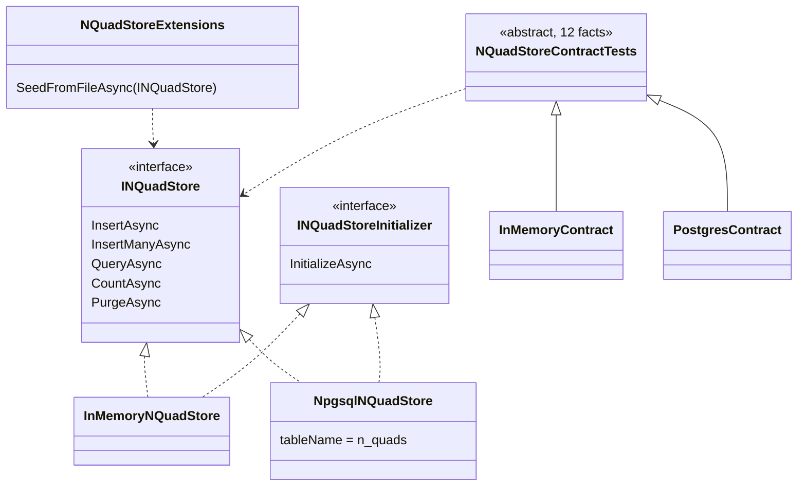

# Stage review: N-Quad store interface, in-memory store, shared contract (stage 1)

Date: 2026-09-26. Repo: `Adventures.Foundation`, branch `nguid-slice`. Committed locally; not pushed until you review.

## What was built
- `INQuadStore`: `InsertAsync`, `InsertManyAsync`, `QueryAsync`, `CountAsync`, `PurgeAsync` (all with `CancellationToken`). The Postgres surface, minus what is not store maintenance.
- `INQuadStoreInitializer`: `InitializeAsync`, idempotent. `NpgsqlNQuadStore` creates the table and indexes; the in-memory store does nothing.
- `NQuadStoreExtensions.SeedFromFileAsync`: parse a `.nq` file and `InsertManyAsync`, so it works on any store.
- `InMemoryNQuadStore`: thread-safe, ported from the POC's `InMemoryQuadrupleStore` and reshaped to the async contract.
- `NpgsqlNQuadStore` now implements both interfaces, takes an optional table name (default `n_quads`, validated lower-case identifier), and inserts a batch inside one transaction so it is all-or-nothing.
- **One contract test class** (`NQuadStoreContractTests`, 12 facts) run against both stores. The in-memory run always executes. The Postgres run executes against the dev database using a **scratch table per fact** (dropped afterwards), so the dev `n_quads` table is never truncated.

## Decisions applied (your answers)
| Question | Decision |
|---|---|
| By-id Get/Update/Delete | Not in this layer. Two concerns: (1) store maintenance = this stage; (2) CRUDL over `DynamicEntity` classes (User first) = the next stage, with its own interface. |
| Duplicate id | The store throws; the type is not pinned. Exception handling is a separate design (see `Claude-decision-2026-09-exception-handling-direction.md`). |
| Scratch table for Postgres runs | Yes, constructor option. |
| Where `CreateTableAsync` lives | `INQuadStoreInitializer`. |
| Q5 (consumers this stage) | Only the two stores; `NQuadUserAdapter` and `Adventures.Entities` are untouched. |

## Verified
Red first (tests referenced `INQuadStore`; build failed as expected), then green. `Adventures.Data.NQuad.Tests` 29 of 29 pass, including the 12 contract facts against **both** in-memory and real Postgres (seeding from the official `seed.nq`, atomic batch, cancellation, idempotent initialize). Whole solution: 24 + 51 + 22 + 29 + 1 = 127 passing (was 103). `ai-research-blog` still builds against the changed library.

## Not covered / follow-ups
- The names: the code uses `InMemoryNQuadStore` (you called it `InMemoryQuadrupleStore`, the POC's name). Say if you want the POC name kept.
- DI switch (`NQuad:Store = InMemory | Postgres`) not built; comes with the next stage's wiring.
- Result ordering is deliberately undefined; tests do not depend on it.
- I could not independently list the Postgres server after the run to confirm no `nqc_*` scratch tables were left; `DROP TABLE IF EXISTS` runs in each fact's dispose.

## Next (your call after review)
Stage 2: the CRUDL data layer over `DynamicEntity`-derived classes (User first), with an interface, built on `INQuadStore`.
