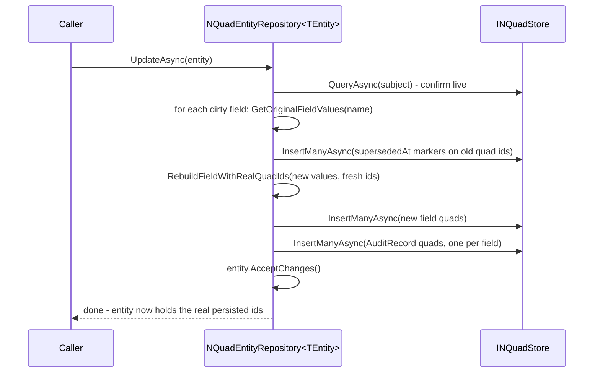
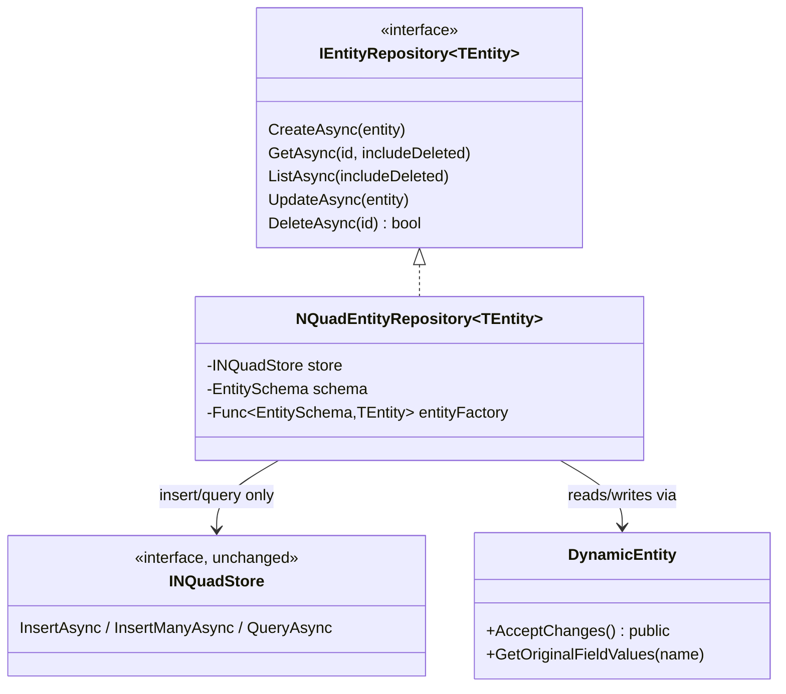

# Stage review: `IEntityRepository<TEntity>` - tombstone delete, supersede update, audit trail (stage 2)

Date: 2026-09-27. Repo: `Adventures.Foundation`, branch `nguid-slice`. Not yet pushed.

## What was built
- `IEntityRepository<TEntity>` (`Adventures.Entities`, storage-agnostic): `CreateAsync`, `GetAsync`/`ListAsync` (both with `includeDeleted`), `UpdateAsync`, `DeleteAsync` returning `bool`. No business rules - that is a future `Bll`'s job (e.g. `SchemaBll`), not this layer's.
- `NQuadEntityRepository<TEntity>` (`Adventures.Data.NQuad`): the N-Quad-backed implementation. Generic like the POC's `GenericDal<TEntity>` - schema, base/type IRIs, graph, and an entity factory are constructor arguments, so a schema with no dedicated class (a future `Schema`/`SchemaField` pair, or `GenericEntity`) is served exactly like `User`, no per-entity-type subclass required.
- `INQuadStore` is untouched - still insert/query only. Delete and update are both purely additive:
  - **Delete** inserts one `lifecycle#deletedAt` quad on the subject. Nothing else is touched. Hidden by default on read; `includeDeleted: true` still returns it.
  - **Update** marks *every* prior quad of a dirty field superseded (`lifecycle#supersededAt` on the old quad's own id - not just the first, so a multi-valued field like `User.Email`'s two values both get retired), then inserts new quad(s) with fresh ids.
  - Both write one `AuditRecord` entity per changed field - reusing the exact schema/predicates already sitting unused in `seed.nq` and the POC's `PocConstants.Audit`, not reinvented. Deliberately separate from the `supersededAt`/`deletedAt` markers: the audit trail is the human-facing "what changed and why" log, the markers are cheap mechanical bookkeeping nothing but the repository itself ever reads.
- Two small, backward-compatible additions to `DynamicEntity`: `AcceptChanges` is now `public` (a repository in a different assembly has to call it after a successful write), and `GetOriginalFieldValues(name)` exposes *every* prior value for a field, not just the first - needed for correct multi-valued supersede.

## Decisions applied (your answers, this session)
| Question | Decision |
|---|---|
| Delete semantics | Tombstone, not hard delete. |
| Update semantics | Supersede (insert new + mark old), not replace-in-place. |
| Store-vs-CRUDL boundary | Two separate concerns/interfaces - confirmed: `INQuadStore` (store maintenance) never grows delete/update-by-id; `IEntityRepository<TEntity>` owns lifecycle. |
| Audit trail | A proper `AuditRecord` entity per changed field, not just a bare marker - reusing the already-seeded (unused) `AuditRecord` schema and the POC's `PocConstants.Audit` predicates verbatim. |
| Marker vs. audit record | Kept separate (your choice, option 1): a small mechanical `supersededAt`/`deletedAt` marker for "what's current", `AuditRecord` purely as the human-facing log. |
| Interface naming | Delegated to Claude going forward (not just this interface). |

## Verified
Red first for the id-rebuild bug (see below), then green. New: `NQuadEntityRepositoryTests`, 10 facts (create/get round trip, duplicate-id throws, one audit row per field on create, update supersedes a single-valued field while the old quad stays physically present, update supersedes *every* original quad of a multi-valued field, update-on-deleted throws, delete tombstones and hides by default but `includeDeleted` still reads it with untouched field quads, delete-twice returns false, delete writes one audit row per field, list excludes/includes deleted). Whole solution offline: 116 passing (was 106).

**Caught by the tests, not by inspection:** the repository must rebuild an entity's field values with the *real*, persisted quad ids after `CreateAsync`/`UpdateAsync` (`RebuildFieldWithRealQuadIds`). A transient entity is built with caller-supplied placeholder ids (there's no way for the caller to know the real id in advance); without rewriting them to the real ids post-write, a second `UpdateAsync` on that same instance would supersede a quad id that was never actually written, leaving the real one live forever. First implementation missed this; the multi-valued-field test caught it immediately.

## Not covered / follow-ups
- `IEntityRepository<Schema>`/`IEntityRepository<SchemaField>` - the meta-circular "Schema is just another DynamicEntity" piece - not built yet; this stage only proves the mechanism against `User`.
- No `SchemaBll`/`UserBll` yet - business rules layer is still open.
- `ListAsync`'s type-quad query plus one `GetAsync` per entity is N+1; fine at this scale, a candidate to revisit if it ever matters.
- The "Claude" user (for blogging/research, per your ask) is intentionally not seeded yet - deferred until this repository's `CreateAsync` path has a real exercise to prove it against, rather than hand-seeding it now.

## Next (your call after review)
`Schema`/`SchemaField` as `DynamicEntity` types with no dedicated class, served by `IEntityRepository<GenericEntity>` once `GenericEntity` is ported from the POC - the meta-circular piece that started this whole design conversation.
