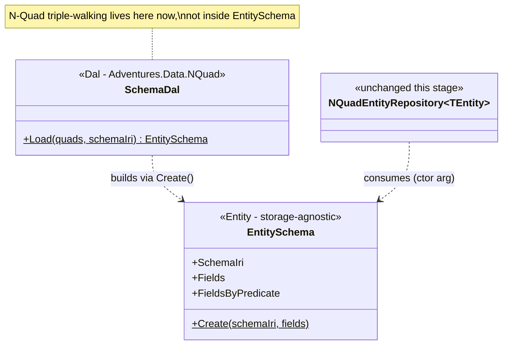

# Stage review: split `EntitySchema` into Entity / Dal / Bll (stage 1 of 3)

Date: 2026-09-28. Repo: `Adventures.Foundation`, branch `nguid-slice`. Not yet pushed.

## Why
`EntitySchema` was playing three roles at once: **Entity** (field metadata every `DynamicEntity`
needs), **Dal** (its static `Load(triples, schemaIri, typePredicate, ...)` walked raw N-Quad
triples to discover a schema's fields), and **Bll** (the tail of `Load` enforced "at least one
field", "no duplicate field name", "no duplicate predicate"). `NQuadEntityRepository<TEntity>`
was already clean - it takes a pre-built `EntitySchema` and never inspects any specific schema's
shape. `EntitySchema` was the one piece still doing Dal+Bll work under an Entity's name, and it's
a dependency of every other `DynamicEntity`, so the coupling only gets more expensive to unwind
the longer it's left. This is stage 1 of the 3-stage plan agreed before starting (see chat); it
was the low-risk one - `EntitySchema.Load` had exactly one call path in the whole repo.

## What was built
- `EntitySchema` (`Adventures.Entities/EntitySchema.cs`): the static `Load(triples, schemaIri,
  typePredicate, typeIri, fieldPredicate, fieldNamePredicate, fieldTypePredicate,
  fieldRdfPredicate, fieldValuePrefixPredicate)` factory is gone. In its place, `Create(schemaIri,
  IEnumerable<EntitySchemaField> fields)` - a plain, storage-agnostic constructor that only
  enforces the field list's own invariants (≥1 field, no duplicate name, no duplicate predicate).
  It has no idea what an N-Quad is.
- `SchemaDal` (new, `Adventures.Data.NQuad/SchemaDal.cs`): owns the triple-walking `Load` used to
  do - find the schema subject, its `schema#field` subjects, each field's name/type/predicate/
  valuePrefix via `EntityConstants.Schema.*` - then calls `EntitySchema.Create`. Generalized to
  take any `schemaIri`, not just the User schema (`NQuadUserAdapter.LoadUserSchema` hardcoded
  `EntityConstants.Schema.UserIri`). Proven against the *AuditRecord* schema too, which was
  already sitting fully described but unused in `seed.nq` - no seed changes needed.
- `NQuadUserAdapter.LoadUserSchema` removed; `LoadUsers` (unrelated - materializes `User`
  instances, not schema metadata) is untouched. The two call sites now call `SchemaDal.Load(...)`.
- `NQuadEntityRepository<TEntity>`: **zero changes.** It never touched `EntitySchema.Load` and
  still doesn't touch `SchemaDal` - confirms the coupling really was isolated to the one type.

## Verified
Red first: wrote `EntitySchemaTests` (6 facts - builds `Fields`/`FieldsByPredicate`, case-
insensitive name lookup, throws on zero fields / duplicate name / duplicate predicate / blank
schema IRI) and `SchemaDalTests` (3 facts - loads the User schema, loads the AuditRecord schema
from the same seed file, throws on an unknown schema IRI) against the target shape before the
production code existed. Then extracted `EntitySchema.Create`/`SchemaDal.Load`, fixed the two
call sites, and confirmed the whole offline suite (`--filter FullyQualifiedName!~Postgres`) is
still green: **125 passing (was 116)** - 51 Security, 7 Entities (was 1: `UserAndUserSchemaTests`
+ 6 new `EntitySchemaTests`), 22 Identity, 3 Ioc, 6 Common, 36 Data.NQuad (was 27: existing +
9 new: 6 `EntitySchemaTests` are in Entities.Tests, so 3 `SchemaDalTests` here).

## Not covered / follow-ups (stage 2-3, per the agreed plan)
- `SchemaEntity`/`SchemaFieldEntity` as ordinary `DynamicEntity` types, served by
  `NQuadEntityRepository<SchemaEntity>` with zero repository changes - the meta-circular "a schema
  is just another entity" piece. Needs a hand-authored, bootstrapped `EntitySchema` for each (the
  one fixed point that can't be loaded from the store without infinite regress).
- `SchemaBll` - validates a `SchemaEntity` + its fields *before* persistence (same invariants
  `EntitySchema.Create` enforces, caught earlier for better authoring-time errors) and is where
  future schema-authoring business rules live. Not built yet.
- `SchemaDal` will be upgraded in stage 3 to fetch via `NQuadEntityRepository<SchemaEntity>`/
  `<SchemaFieldEntity>` instead of hand-walking triples, retiring today's interim triple-walking.

## Next (your call after review)
Stage 2: `SchemaEntity`/`SchemaFieldEntity` as `DynamicEntity` types, CRUDL'd through
`NQuadEntityRepository<TEntity>` with no repository changes, proving the design goal directly.
