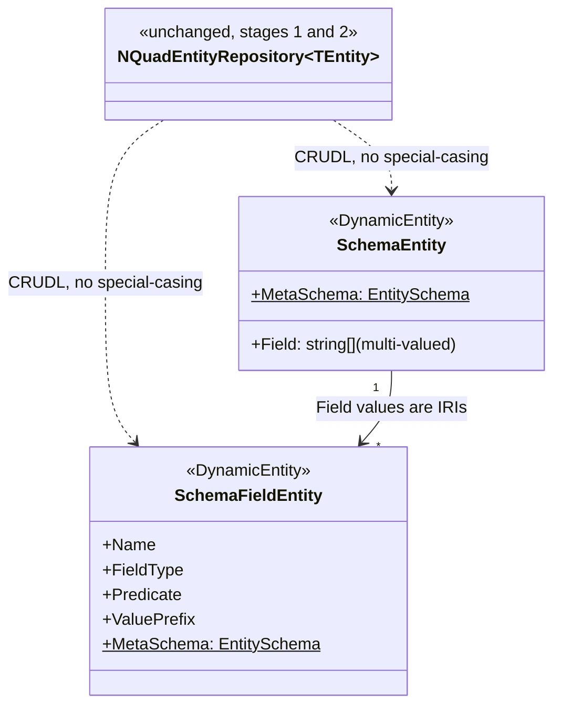

# Stage review: `SchemaEntity`/`SchemaFieldEntity` as ordinary `DynamicEntity` types (stage 2 of 3)

Date: 2026-09-28. Repo: `Adventures.Foundation`, branch `nguid-slice`. Not yet pushed.

## Why
Stage 1 decoupled `EntitySchema` from N-Quad parsing. This stage is the meta-circular piece that
motivated the whole refactor: make a schema definition itself an ordinary `DynamicEntity`, CRUDL'd
through `NQuadEntityRepository<TEntity>` exactly like `User` - proving the repository never needs
to know anything schema-specific, only `DynamicEntity`.

## What was built
- `SchemaEntity` and `SchemaFieldEntity` (`Adventures.Entities`): thin sealed `DynamicEntity`
  subclasses, exactly like `User`. `SchemaEntity` has one field, `Field` (multi-valued), holding
  the IRIs of the `SchemaFieldEntity` instances that describe its shape. `SchemaFieldEntity`
  mirrors the four quads a hand-authored schema field already carries in `seed.nq`: `Name`,
  `FieldType`, `Predicate`, `ValuePrefix`.
- Each carries a hand-authored `MetaSchema` (a static `EntitySchema`, not loaded from any store) -
  the one fixed point that can't be loaded without infinite regress, since a schema describes every
  other entity's shape including its own. Mirrors the POC's `PocConstants` - fixed, compile-time
  vocabulary. Both needed an `Id` field of their own (`EntityConstants.Schema.IdentifierPredicate`,
  new) even though `NQuadEntityRepository` never writes a quad for it - caught immediately by the
  first test run: `DynamicEntity.Set` requires every property it's given to be a declared schema
  field, and `MaterializeAsync` always calls `Set(IdPropertyName, ...)`.
- `EntityConstants.Schema` gained four new IRIs for these instances (`EntityBaseIri`/`EntityTypeIri`
  for `SchemaEntity`, `FieldEntityBaseIri`/`FieldEntityTypeIri` for `SchemaFieldEntity`) plus
  `IdentifierPredicate`. `EntityTypeIri` deliberately reuses `Schema.TypeIri` (`ontology/schema#Schema`)
  - same concept, just paired with the standard rdf:type predicate `NQuadEntityRepository` always
  uses, not the `schema#type` marker `SchemaDal` reads.
- `NQuadEntityRepository<TEntity>`: **zero changes**, same as stage 1.

## An important finding, not a bug
The seed-authored `schema/User` and `schema/AuditRecord` subjects predate this repository and were
written for `SchemaDal`'s triple-walking only - marked with the custom `schema#type` predicate, not
the standard rdf:type triple `NQuadEntityRepository` requires for `ListAsync`. So:
- `_schemaRepository.ListAsync()` does **not** surface them (asserted explicitly, not just assumed).
- `_schemaRepository.GetAsync("User")` **does** still read them correctly - `GetAsync` never
  depends on the type triple, only on the subject and its field predicates matching `MetaSchema`.

This means the two "a schema is a Schema" conventions currently coexist unreconciled: `SchemaDal`'s
`schema#type` marker (read-only, still used by stage 1's `SchemaDal.Load`) and the new standard
rdf:type convention (write+read, used by `NQuadEntityRepository<SchemaEntity>`). Deliberately did
**not** touch `seed.nq` to add the standard triple to the legacy subjects - that's a seed-triad
change (kept in sync with `poc`'s `mock-data.txt`/`validated.csv`) and a call worth making
separately, not a side effect of this stage. See "Not covered" below.

## Verified
`dotnet build` clean. New `SchemaEntityRepositoryTests` (6 facts: `SchemaFieldEntity` create/get
round trip, a `SchemaEntity` created with `Field` values that reference two real, just-created
`SchemaFieldEntity` subjects, update supersedes, delete tombstones, list excludes the legacy
seed-authored schemas while including repository-created ones, get still reads the legacy "User"
schema by id) - all passed on the first run once the `Id`-field fix above landed. Full offline
suite: **131 passing (was 125)**.

## Not covered / follow-ups (stage 3, per the agreed plan)
- `SchemaBll`: pre-persistence validation of a `SchemaEntity` + its fields (same invariants
  `EntitySchema.Create` already enforces, caught earlier) and the translation into an `EntitySchema`
  metadata instance. Not built yet.
- `SchemaDal` upgrade: fetch via `NQuadEntityRepository<SchemaEntity>`/`<SchemaFieldEntity>` instead
  of hand-walking triples, retiring stage 1's interim triple-walking.
- Whether/how to reconcile the two "is a Schema" conventions found above - e.g. migrating `seed.nq`
  to also carry a standard rdf:type triple on `schema/User`/`schema/AuditRecord` so they become
  `ListAsync`-discoverable too - is an open question for you to weigh in on, not decided here.

## Next (your call after review)
Stage 3: `SchemaBll` + upgrade `SchemaDal` to fetch through the new repositories. Also worth a
decision: reconcile or leave separate the two "is a Schema" markers found above.
