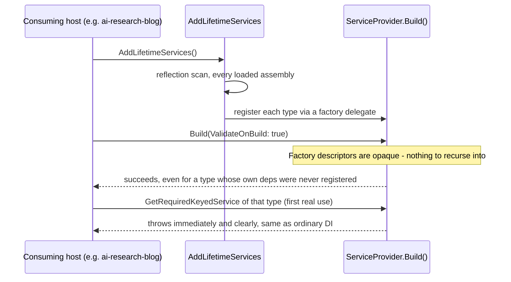

# Stage review: `AddLifetimeServices` registers lazily (ValidateOnBuild fix)

Date: 2026-10-01. Repo: `Adventures.Foundation`, branch `nguid-slice`. Not yet pushed.

## Why
Found in `ai-research-blog` (2026-09-29, stage C of the login/profile CRUDL objective): a real
`dotnet run` failed to start. `AddLifetimeServices()` reflection-scans every loaded assembly, so it
auto-registered `Adventures.Entities.SchemaBll` even though that host does not use `ISchemaBll` -
and ASP.NET Core's `ValidateOnBuild` (on by default in Development) walks every registered
service's constructor at `Build()` time, including ones nobody requests. `SchemaBll` needs
`IEntityRepository<SchemaEntity>`/`<SchemaFieldEntity>`, which that host never registered, so
`Build()` threw. Worked around there by registering those two repositories anyway - but the
underlying question was whether this is inherent to "auto-register everything with a lifetime
marker," or fixable. It is fixable.

## What was built
Verified empirically first (a throwaway scratch console project, not kept) before touching
production code: a direct `ServiceDescriptor(serviceType, implementationType, lifetime)`
registration gives the container a constructor it can recurse into, so `ValidateOnBuild` fails over
an unsatisfiable dependency whether or not anything ever resolves that service. A factory-based
registration (`ServiceDescriptor(serviceType, (sp, _) => ActivatorUtilities.CreateInstance(sp,
implementationType), lifetime)`) is opaque to the validator - nothing to recurse into - so `Build()`
succeeds. Resolving it still throws immediately and clearly at first use, identical to what
ordinary DI would do for any broken registration. Confirmed for both the keyed and unkeyed
registration shapes `AddLifetimeServices` uses.

`Adventures.Ioc/Extensions/ServiceCollectionExtensions.cs`'s `AddLifetimeServices` now registers
every discovered type (both the keyed and, where unambiguous, unkeyed registration) via that
factory delegate instead of a direct type registration. No change to its public signature, to the
reflection scan itself, or to any existing Bll/Presenter/Dal type - every current consumer keeps
working exactly as before; only unused-but-broken registrations stop being collateral damage.

## Verified
Red first, reproducing the real incident exactly: temporarily reverted the fix (`git stash` on just
the one file) and confirmed the new tests fail with the identical `AggregateException`/"Unable to
resolve service for type..." shape `ai-research-blog` hit. Restored the fix, both green.
`AddLifetimeServicesLazyValidationTests` (`Adventures.Ioc.Tests`, 2 facts): `Build()` does not throw
for a type with an unsatisfiable dependency nobody resolves; resolving that same type still throws
`InvalidOperationException` immediately. Full offline suite: **145 passing (was 143)**.

## Not covered / follow-ups
- The reflection scan itself (`AppDomain.CurrentDomain.GetAssemblies()`) is still broad - every
  loaded assembly, not just ones a host cares about. That is a different, independent concern
  (startup cost, name-collision risk) from the one fixed here, and was discussed but not changed.
- `ai-research-blog`'s workaround (registering `IEntityRepository<SchemaEntity>`/
  `<SchemaFieldEntity>` even though it does not use `ISchemaBll`) is now unnecessary - it just no
  longer causes a crash either way. Not reverted here since that is a separate repo/commit; noted
  for whenever that stage is revisited.

