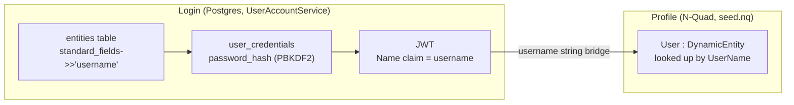

# Stage I review — real Admin/Admin and Claude/Claude dev login credentials

## What changed

Real PBKDF2-HMAC-SHA256 password hashes (never printed, computed via `PasswordHasher.Hash`) were
seeded into the live dev Postgres (`aiblogdv`) for two accounts: `Admin`/`Admin` and
`Claude`/`Claude` — the deliberately-public BlogEngine.NET-style default convention, not secrets.

The key architectural finding (confirmed before writing any seed data): login
(`Adventures.Identity.UserAccountService.LoginAsync`) queries the **older** Postgres
`entities`/`user_credentials` tables by `tenant` + `username` — a completely separate id space
from the N-Quad `User` store `seed.nq` feeds. The two are bridged only by matching **username
strings** (`ProfileController`'s own doc comment confirms this), never by id. So the Postgres row
ids generated for Admin/Claude do not, and do not need to, match `seed.nq`'s Admin/Claude entity
GUIDs.

## Work done

- New `seed-global-webnet-accounts.sql` (Adventures.Foundation, `src/Adventures.Data/Sql/`) —
  separate from the generic `seed-tenant-admin.sql` onboarding template, since this one is specific
  to `global-webnet.com`'s two real dev accounts, not a per-tenant-onboarding script. Genuinely
  idempotent: looks each username up first and updates its credential row in place rather than
  inserting a duplicate account on a re-run.
- New `docs/Claude-pg-exec` tool (workspace root) — the Postgres counterpart to the existing
  `Claude-sql-schema.ps1` (SQL Server). Modern Npgsql (net6.0+) cannot load into Windows PowerShell
  5.1 the way `System.Data.SqlClient` can (no netstandard2.0 build), so this is a tiny `dotnet run`
  console tool instead of a pure `.ps1` script. SELECTs print rows (used for read-only
  verification); everything else runs as a command.
- Real bug found and fixed in `Claude-secret.ps1`'s `Set-UserSecret` (used by `sync`/`usersecret`):
  PowerShell's `|` to a native process always writes stdin as UTF-8 **with** a BOM, which `dotnet
  user-secrets`' stdin JSON parser rejects outright. Fixed by routing through a BOM-less temp file
  and `cmd.exe`'s `<` redirection instead.
- Applied the seed file to the live dev Postgres via the existing vault mechanism
  (`Claude-secret.ps1 run postgres/aiblogdv/a2cb58_aiblogdv -EnvVar PGPASSWORD -Exec dotnet ...`).

## Verification — full real, authenticated round trip

Ran the actual `ai-research-blog` WebApi (`dotnet run`, real Postgres, real `seed.nq`-backed
N-Quad store) and exercised it over HTTP, not just unit tests:

- `POST /api/auth/token` with `Admin`/`Admin` → 200, real JWT, `mustChangePassword: true`.
- `POST /api/auth/token` with `Claude`/`Claude` → 200, real JWT, `mustChangePassword: true`.
- `POST /api/auth/token` with `Admin`/wrong password → 401.
- `GET /api/profile/me` as Admin → the real N-Quad profile: `First: "Admin"`, `Last: "User"`,
  `DisplayName: "Admin User"`, `Phone: null`, `DOB: null` (confirms Stage G's removal of the real
  phone/birthday data held, not just a rename).
- `GET /api/profile/me` as Claude → Claude's own distinct N-Quad profile.
- `DELETE /api/profile/me` as Admin → 409 `"You cannot delete your own account."` — the one
  business rule, proven against a live, authenticated request.

## Next

Merge-to-`main`/deploy is a separate, later, human-confirmed step - not part of this work.
