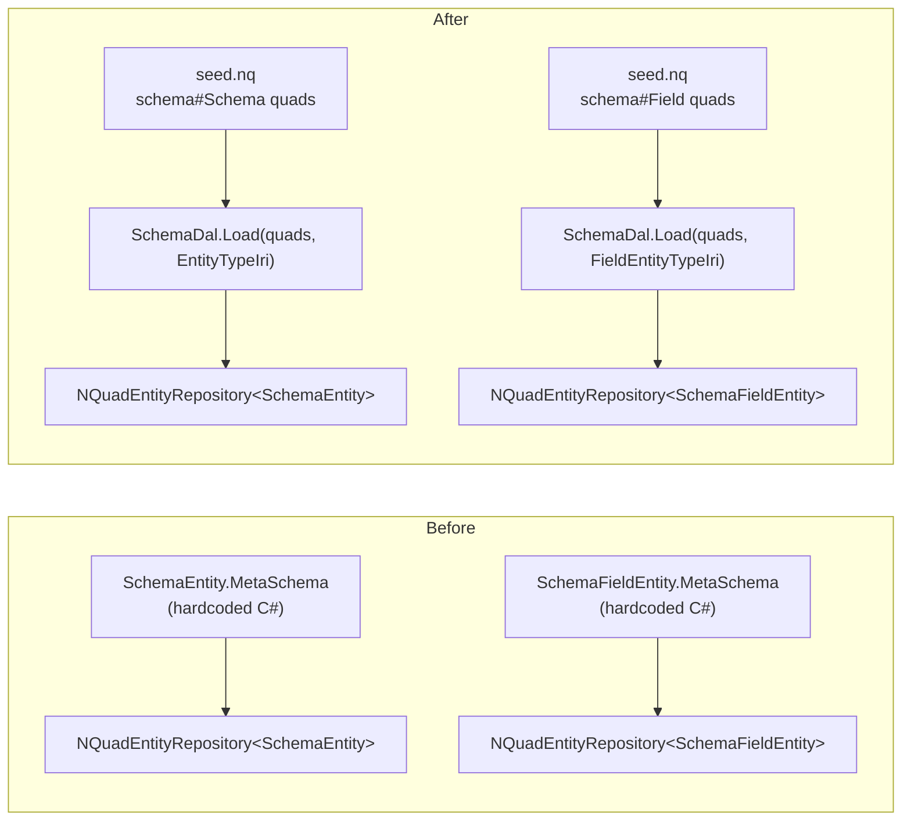

# Stage H review — Schema/SchemaField meta-schema loaded from seed, not hardcoded

## What changed

`SchemaEntity` and `SchemaFieldEntity` used to carry a hardcoded static `MetaSchema` property in
C# describing their own shape. That was the last piece of "special-cased" data in the schema
engine — every other `DynamicEntity`'s shape comes from seed quads read through `SchemaDal.Load`.

The insight that unblocks this: the fixed point was never the *data*, it is the *parsing
algorithm*. `SchemaDal.Load` already knows how to walk `schema#type`/`schema#field`/`schema#name`/
`schema#fieldType`/`schema#predicate`/`schema#valuePrefix` triples for any schema IRI. "Schema" and
"SchemaField" describing their own shape with that exact same vocabulary is not infinite regress —
it is just one more schema the existing algorithm can load.

## Work done

- Added quads to `seed.nq` describing `ontology/schema#Schema`'s own shape (one field, "Field" ->
  `schema#field`) and `ontology/schema#Field`'s own shape (fields Name/FieldType/Predicate/
  ValuePrefix -> their existing predicates), using the same `schema#type`/`schema#field`/...
  vocabulary every other seeded schema already uses.
- Removed the hardcoded `MetaSchema` static property from `SchemaEntity.cs` and
  `SchemaFieldEntity.cs`. Each now just wraps an `EntitySchema` passed into its constructor, like
  any other `DynamicEntity`.
- Updated every caller to load the schema the same way the User schema is already loaded:
  `SchemaDal.Load(quads, EntityConstants.Schema.EntityTypeIri)` /
  `SchemaDal.Load(quads, EntityConstants.Schema.FieldEntityTypeIri)`. Callers touched:
  `EntityPresenterTests`, `SchemaBllTests`, `SchemaEntityRepositoryTests`,
  `EntityControllerBaseTests` (Adventures.Foundation), and `Program.cs` (ai-research-blog).
- `Adventures.WebApi.Tests.csproj` needed the `seed.nq` file link added — it had not needed the
  seed file before this stage.

## Verification

- `Adventures.Foundation`: full solution rebuilt, **203 tests passing** across all 8 test
  projects (Security 51, Data 24, Identity 22, Ioc 5, Common 6, Entities 30, Data.NQuad 57,
  WebApi 8).
- `ai-research-blog`: `AiBlogResearch.slnx` rebuilt clean; `AiBlogResearch.WebApi.Tests`
  (26 tests) passing; a `dotnet run` smoke test of the WebApi host started cleanly with no
  `ValidateOnBuild` DI crash — the same class of bug this discipline caught twice before stayed
  caught.

## Next

Stage I: real Admin/Admin and Claude/Claude credentials into the live dev Postgres.
